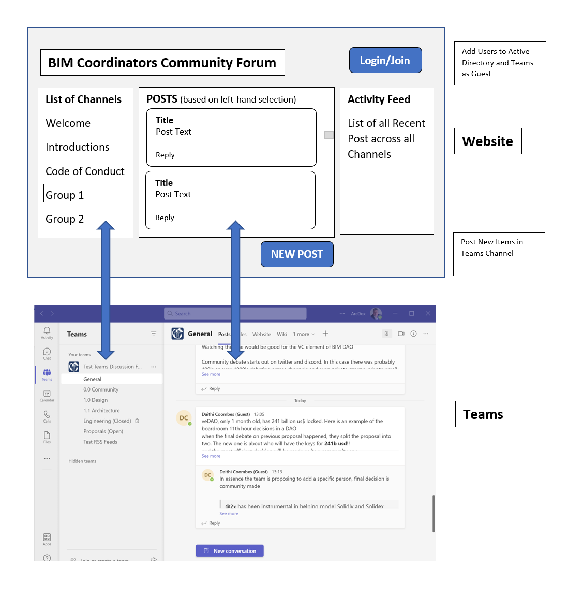

# teams-based-chat-sample-app
The goal of this project is to demonstrate how to write a lightweight chat application using MS Teams as backend

There are two sub-projects:
* backend:
  * written in PHP
  * entry point: backend/index.php
  * input params: $_GET["email"] and $_GET["name"]
  * purpose: invite a guest user to Azure AD using Graph API
* frontend:
  * Angular application that implements the frontend of the Microsoft Teams according to the below mockup

